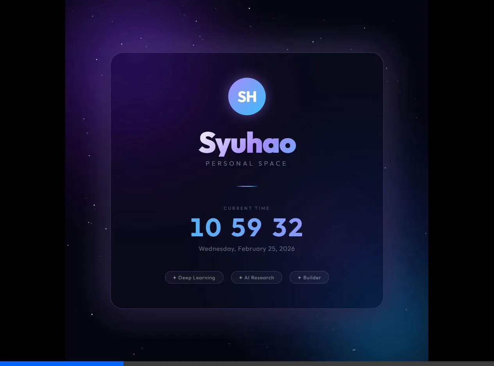

# Syuhao's Personal Space

## Overview

Today, we developed and deployed a modern, premium personal webpage for **Syuhao**. The project involved creating a high-quality frontend and setting up a robust version control workflow with GitHub.

**Live Demo:** [https://syuhao666.github.io/deep_learning/](https://syuhao666.github.io/deep_learning/)



## ✨ Features

- **Live Clock:** Real-time clock updating every second with date display.
- **Glassmorphism Design:** Beautiful frosted-glass UI card.
- **Cosmic Animation:** Dynamic background with drifting gradient orbs and a twinkling HTML5 canvas star field.
- **Responsive:** Adjusts elegantly across desktop and mobile screens.

## 🚀 Tech Stack

- HTML5
- CSS3 (Custom Properties, Flexbox, Animations)
- Vanilla JavaScript (Canvas API, Date Object)

## 📂 Project Structure

```text
📁 deep_learning
└── 📄 index.html    # The main application file (HTML, CSS, JS combined)
└── 📄 README.md     # Project documentation
```

## 🛠️ Usage

1. Open `index.html` in your web browser.
2. The site requires no build steps or dependencies to run locally. Just double-click!

## 🔖 Tags
Deep Learning | AI Research | Builder
